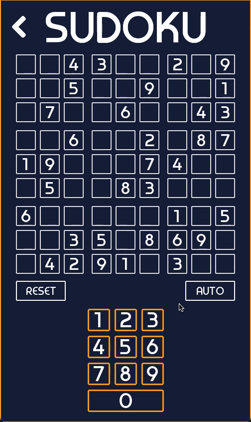

# SudokuSolver

A Pygame-based Sudoku Solver that uses an optimized brute force algorithm implemented with a doubly linked list for increased solving speed.

## Features
- **Visual Representation**: Displays the Sudoku puzzle and solving process using Pygame.
- **Optimized Solving Algorithm**: The solver utilizes a doubly linked list, resulting in faster traversal and manipulation of the puzzle grid.
- **Performance Improvement**: The doubly linked list approach provides improved performance compared to traditional array-based brute force solvers.
- **User Interaction**: Allows users to input custom Sudoku puzzles for solving.

## Technologies
- **Python**
- **Pygame**: For visualizing the Sudoku grid and solving process.
- **Doubly Linked List**: Used to improve the performance of the brute force algorithm.

## How It Works

### Optimized Brute Force with Doubly Linked List
- The solver attempts to fill the Sudoku grid by trying numbers 1 through 9 in each cell and backtracks if a conflict arises.
- Instead of using a standard array, a doubly linked list is used for efficient manipulation of the grid elements, resulting in faster solving times.

### In Action

- 

## Installation

1. Clone this repository:
    ```bash
    git clone https://github.com/yourusername/SudokuSolver.git
    cd SudokuSolver
    ```

2. Install the required dependencies:
    ```bash
    pip install -r requirements.txt
    ```

3. Run the SudokuSolver:
    ```bash
    python main.py
    ```
